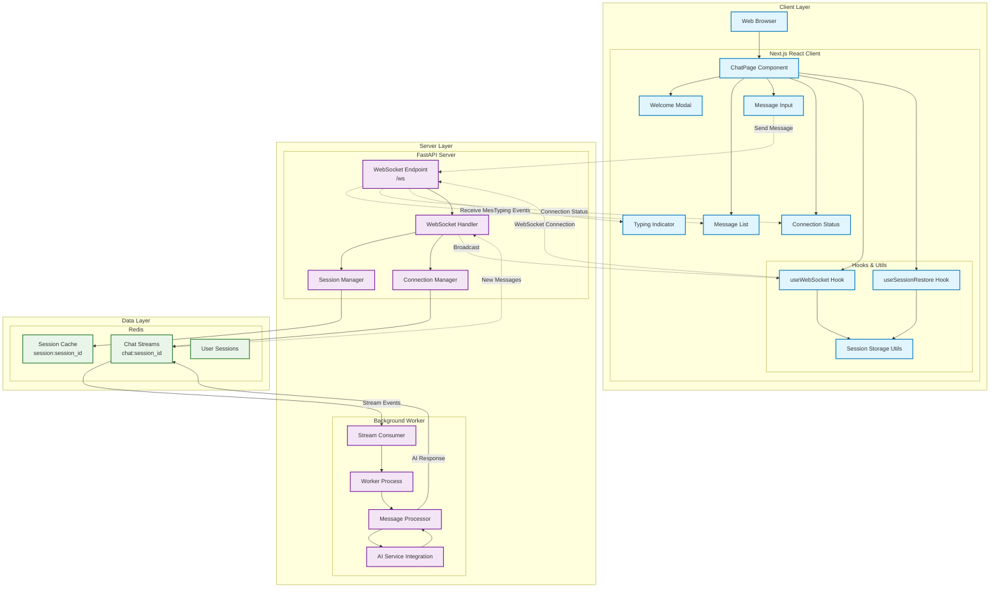
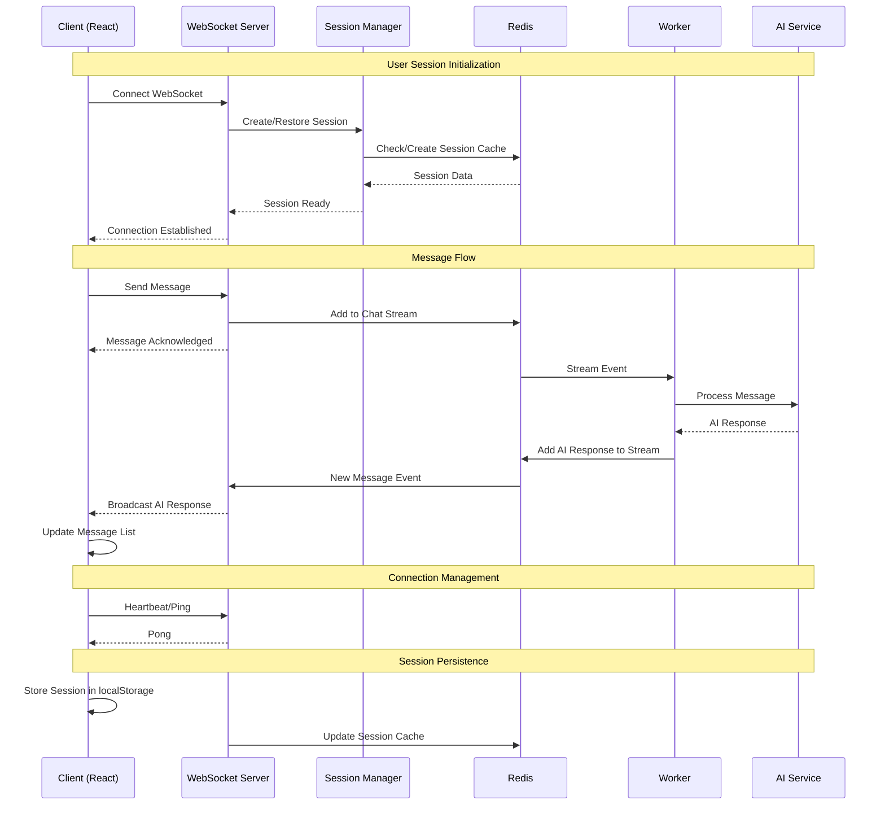
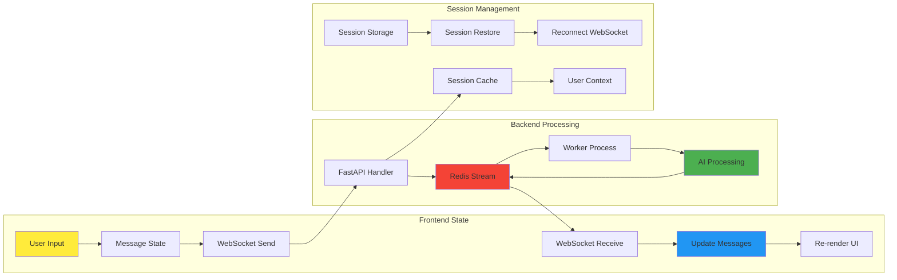

# Fullstack AI Chatbot Architecture

## System Overview Diagram

## Component Interaction Flow

## Data Flow Architecture

## Key Components Description

### Client Side (Next.js React)
- **ChatPage**: Main chat interface component managing overall state
- **useWebSocket**: Custom hook handling WebSocket connection and message flow  
- **useSessionRestore**: Hook for persisting and restoring user sessions
- **Message Components**: UI components for displaying messages, input, typing indicators
- **Session Storage**: Browser storage utilities for session persistence

### Server Side (FastAPI)
- **WebSocket Endpoint**: Main `/ws` endpoint handling real-time connections
- **Session Manager**: Manages user sessions and authentication state
- **Connection Manager**: Handles WebSocket connection lifecycle
- **Worker Process**: Background process consuming Redis streams for AI processing

### Data Layer (Redis)
- **Chat Streams**: Real-time message streams per session (`chat:session_id`)
- **Session Cache**: User session data and state (`session:session_id`)
- **Message Storage**: Persistent chat history and metadata

## Key Features

### Real-time Communication
- WebSocket connections for bi-directional communication
- Message acknowledgments and delivery confirmation
- Connection status monitoring and reconnection logic

### Session Management
- Persistent sessions across page reloads
- Session restoration with message history
- User context maintenance

### Scalability Design
- Redis streams for horizontal scaling
- Background worker processes for AI processing
- Stateless FastAPI server design

### Error Handling & Resilience
- WebSocket reconnection on connection loss
- Worker process health monitoring (needs improvement for sleep/wake cycles)
- Graceful degradation for offline scenarios

## Current Known Issues
1. **Worker Stale Connections**: Worker process stops consuming after MacBook sleep - requires manual restart
2. **Connection Monitoring**: Limited health checks for Redis connections
3. **Error Recovery**: Basic error handling in place but could be enhanced

## Suggested Improvements
1. Implement Redis connection health checks in worker
2. Add automatic worker process restart capability  
3. Enhanced error boundaries in React client
4. Message persistence and offline queue
5. Load balancing for multiple worker instances