# CI/CD Pipeline Summary

🎉 **Your full-stack AI chatbot now has a complete CI/CD pipeline!**

## What Was Created

### 📁 GitHub Actions Workflows
- **`.github/workflows/ci.yml`** - Automated testing, linting, and quality checks
- **`.github/workflows/build-and-push.yml`** - Docker image building and registry pushing
- **`.github/workflows/deploy.yml`** - Automated deployment to staging and production

### 🐳 Production Configuration  
- **`docker-compose.prod.yml`** - Optimized production deployment configuration
- **Resource limits** and **health checks** included
- **Optional monitoring** with Prometheus and Grafana

### 📚 Documentation & Scripts
- **`docs/CICD_SETUP.md`** - Comprehensive setup and troubleshooting guide
- **`scripts/setup-cicd.sh`** - Interactive setup verification script

## Pipeline Flow

```mermaid
graph LR
    A[Push/PR] --> B[CI Tests]
    B --> C{Tests Pass?}
    C -->|Yes| D[Build Images]
    C -->|No| E[❌ Fail]
    D --> F[Push to Registry]
    F --> G[Deploy to Staging]
    G --> H{Tag?}
    H -->|Yes| I[Deploy to Production]
    H -->|No| J[✅ Done]
    I --> J
```



## Key Features

### 🔄 Continuous Integration
- **Server testing** with pytest and coverage
- **Worker testing** with mocked AI API calls  
- **Client testing** with Jest and linting
- **Code quality** checks (Black, flake8, security scans)
- **Integration testing** with real Redis instance

### 🏗️ Build & Registry
- **Multi-platform builds** (amd64/arm64)
- **GitHub Container Registry** integration
- **Automatic tagging** (latest, SHA, semver)
- **SBOM generation** for security compliance
- **Build caching** for faster builds

### 🚀 Deployment
- **Zero-downtime deployments** with health checks
- **Automatic staging** deployment on main branch
- **Production deployment** via Git tags
- **Rollback capability** on health check failures
- **Environment isolation** (staging/production)

### 🔐 Security
- **Secrets management** via GitHub Secrets
- **SSH key-based** server access
- **Container image scanning**
- **Resource limits** and network isolation
- **Dependency security** checks

## Quick Start

1. **Run the setup script:**
   ```bash
   ./scripts/setup-cicd.sh
   ```

2. **Configure GitHub Secrets** (required):
   - `STAGING_SSH_PRIVATE_KEY`
   - `STAGING_HOST`, `STAGING_USER`
   - `STAGING_REDIS_PASSWORD`, `STAGING_GROQ_API_KEY`
   - `PRODUCTION_SSH_PRIVATE_KEY`
   - `PRODUCTION_HOST`, `PRODUCTION_USER`, `PRODUCTION_DOMAIN`
   - `PRODUCTION_REDIS_PASSWORD`, `PRODUCTION_GROQ_API_KEY`

3. **Create GitHub Environments:**
   - Go to **Settings** > **Environments**
   - Create `staging` (auto-deploy)
   - Create `production` (with reviewers)

4. **Set up deployment servers:**
   - Ubuntu/Debian with Docker installed
   - SSH access for deployment user
   - Ports 22, 80, 443, 3000, 8000 open

## Usage

### 🧪 Testing
- **Push to any branch** → CI tests run
- **Open PR** → Full CI validation
- **Merge to main** → Deploy to staging

### 🚀 Deployment  
- **Staging**: Automatic on main branch push
- **Production**: Create and push Git tag
  ```bash
  git tag v1.0.0
  git push origin v1.0.0
  ```
- **Manual**: Use GitHub Actions web interface

### 📊 Monitoring
- **Logs**: `docker compose logs -f`
- **Health**: Built-in endpoints (`/health`)
- **Metrics**: Optional Prometheus + Grafana
- **Notifications**: Slack integration available

## What's Included

### ✅ Production Ready
- Resource limits and auto-restart policies
- Health checks and graceful shutdowns  
- Backup creation before deployments
- Automatic rollback on failures

### ✅ Developer Friendly
- Local testing with act (GitHub Actions runner)
- Comprehensive error messages
- Debug mode for troubleshooting
- Step-by-step documentation

### ✅ Enterprise Ready
- Multi-environment support
- Security best practices
- Compliance reporting (SBOM)
- Audit trail and notifications

## Next Steps

1. **📖 Read the full guide**: `docs/CICD_SETUP.md`
2. **🔧 Configure your servers** and GitHub secrets
3. **🧪 Test with a PR** to validate the pipeline
4. **🚀 Deploy to staging** by pushing to main
5. **🏷️ Tag a release** to deploy to production

## Architecture Benefits

This CI/CD setup provides:

- **🚄 Fast feedback** - Know immediately if changes break anything
- **🔒 Secure deployments** - Secrets managed properly, no manual steps
- **📈 Scalable** - Easy to add new environments or services
- **🔧 Maintainable** - Clear separation of concerns, good documentation
- **🏆 Professional** - Industry best practices implemented

## Support

- **📚 Documentation**: Complete setup guide in `docs/CICD_SETUP.md`
- **🛠️ Script**: Run `./scripts/setup-cicd.sh` for validation
- **🧪 Testing**: All components have comprehensive test coverage
- **🔍 Debugging**: Debug mode and detailed logging available

---

**🎯 Your full-stack AI chatbot is now ready for professional deployment!**

The pipeline will automatically:
- Test your code on every change
- Build optimized Docker images  
- Deploy to staging for validation
- Deploy to production on releases
- Monitor health and rollback if needed

Happy shipping! 🚢